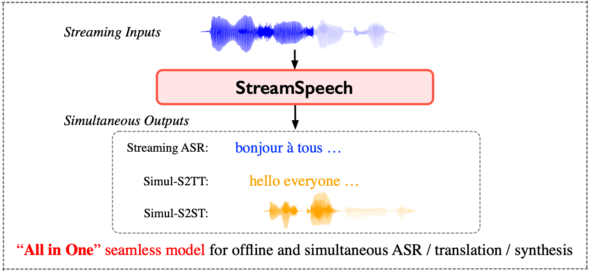
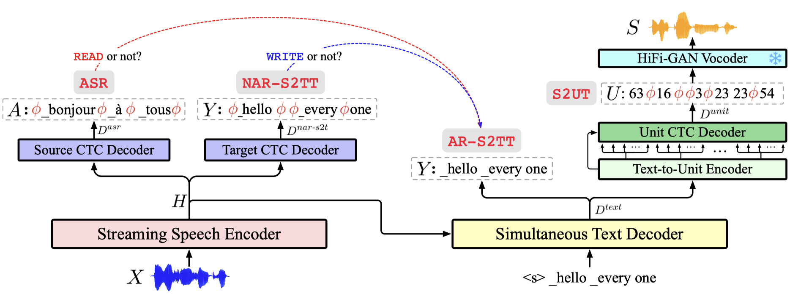
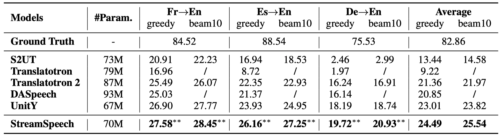
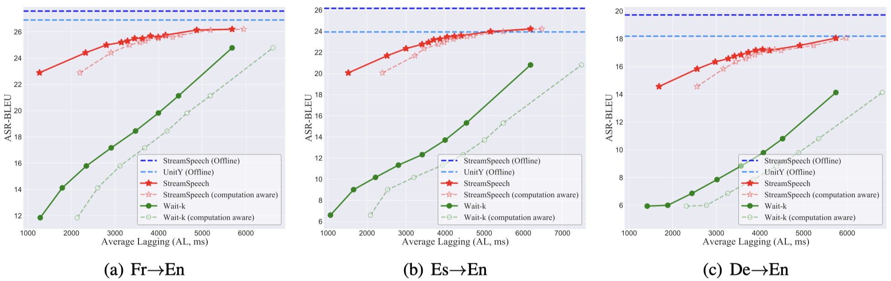
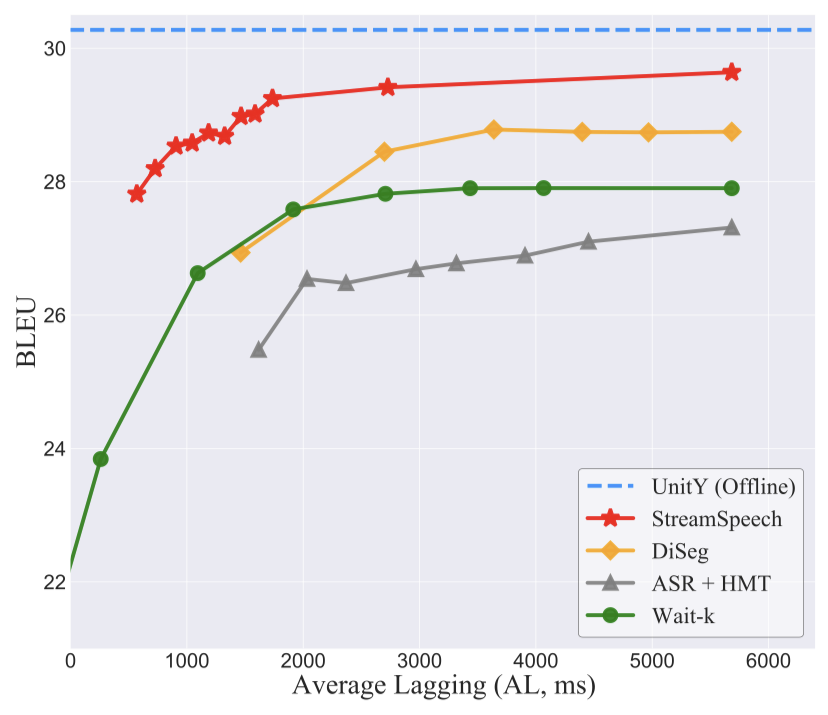
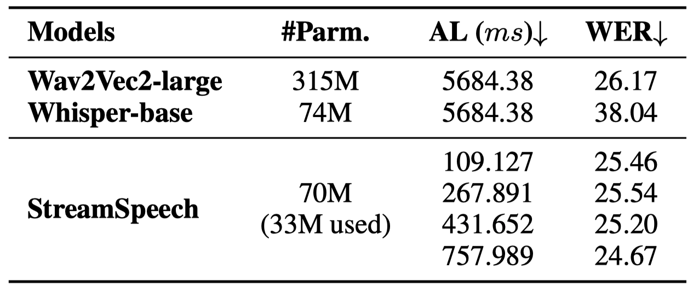

# StreamSpeech

[]()
[](https://ictnlp.github.io/StreamSpeech-site/)
[](https://huggingface.co/ICTNLP/StreamSpeech_Models/tree/main)

> **[Shaolei Zhang](https://zhangshaolei1998.github.io/), [Qingkai Fang](https://fangqingkai.github.io/), [Shoutao Guo](https://scholar.google.com.hk/citations?user=XwHtPyAAAAAJ&hl), [Zhengrui Ma](https://scholar.google.com.hk/citations?user=dUgq6tEAAAAJ), [Min Zhang](https://scholar.google.com.hk/citations?user=CncXH-YAAAAJ), [Yang Feng*](https://people.ucas.edu.cn/~yangfeng?language=en)**


Code for ACL 2024 paper "[StreamSpeech: Simultaneous Speech-to-Speech Translation with Multi-task Learning]()" (paper coming soon).

<p align="center" width="100%">

</p>
<p align="center">
  🎧 Listen to <a href="https://ictnlp.github.io/StreamSpeech-site/">StreamSpeech's translated speech</a> 🎧 
</p>

💡**Highlight**:
1. StreamSpeech achieves **state-of-the-art performance** on both offline and simultaneous speech-to-speech translation.
2. StreamSpeech performs **streaming ASR**, **simultaneous speech-to-text translation** and **simultaneous speech-to-speech translation** via an "All in One" seamless model.
3. StreamSpeech can present intermediate results (i.e., ASR or translation results) during simultaneous translation, offering a more comprehensive low-latency communication experience.

## ⚙Requirements

- Python == 3.10, PyTorch == 2.0.1
- Install fairseq & SimulEval:

  ```bash
  cd fairseq
  pip install --editable ./ --no-build-isolation
  cd SimulEval
  pip install --editable ./
  ```

## 🔥Quick Start

### 1. Model Download

#### (1) StreamSpeech Models

| Language | UnitY                                                        | StreamSpeech (offline)                                       | StreamSpeech (simultaneous)                                  |
| -------- | ------------------------------------------------------------ | ------------------------------------------------------------ | ------------------------------------------------------------ |
| Fr-En    | unity.fr-en.pt [[Huggingface](https://huggingface.co/ICTNLP/StreamSpeech_Models/blob/main/unity.fr-en.pt)] [[Baidu](https://pan.baidu.com/s/10uGYgl0xTej9FP43iKx7Cg?pwd=nkvu)] | streamspeech.offline.fr-en.pt [[Huggingface](https://huggingface.co/ICTNLP/StreamSpeech_Models/blob/main/streamspeech.offline.fr-en.pt)] [[Baidu](https://pan.baidu.com/s/1GFckHGP5SNLuOEj6mbIWhQ?pwd=pwgq)] | streamspeech.simultaneous.fr-en.pt [[Huggingface](https://huggingface.co/ICTNLP/StreamSpeech_Models/blob/main/streamspeech.simultaneous.fr-en.pt)] [[Baidu](https://pan.baidu.com/s/1edCPFljogyDHgGXkUV8_3w?pwd=8gg3)] |
| Es-En    | unity.es-en.pt [[Huggingface](https://huggingface.co/ICTNLP/StreamSpeech_Models/blob/main/unity.es-en.pt)] [[Baidu](https://pan.baidu.com/s/1RwIEHye8jjw3kiIgrCHA3A?pwd=hde4)] | streamspeech.offline.es-en.pt [[Huggingface](https://huggingface.co/ICTNLP/StreamSpeech_Models/blob/main/streamspeech.offline.es-en.pt)] [[Baidu](https://pan.baidu.com/s/1T89G4NC4J0Ofzcsc8Rt2Ww?pwd=yuhd)] | streamspeech.simultaneous.es-en.pt [[Huggingface](https://huggingface.co/ICTNLP/StreamSpeech_Models/blob/main/streamspeech.simultaneous.es-en.pt)] [[Baidu](https://pan.baidu.com/s/1NbLEVcYWHIdqqLD17P1s9g?pwd=p1pc)] |
| De-En    | unity.de-en.pt [[Huggingface](https://huggingface.co/ICTNLP/StreamSpeech_Models/blob/main/unity.de-en.pt)] [[Baidu](https://pan.baidu.com/s/1Mg_PBeZ5acEDhl5wRJ_-7w?pwd=egvv)] | streamspeech.offline.de-en.pt [[Huggingface](https://huggingface.co/ICTNLP/StreamSpeech_Models/blob/main/streamspeech.offline.de-en.pt)] [[Baidu](https://pan.baidu.com/s/1mTE4eHuVLJPB7Yg9AackEg?pwd=6ga8)] | streamspeech.simultaneous.de-en.pt [[Huggingface](https://huggingface.co/ICTNLP/StreamSpeech_Models/blob/main/streamspeech.simultaneous.de-en.pt)] [[Baidu](https://pan.baidu.com/s/1DYPMg3mdDopLY70BYQTduQ?pwd=r7kw)] |

#### (2) Unit-based HiFi-GAN Vocoder

| Unit config       | Unit size | Vocoder language | Dataset                                             | Model                                                        |
| ----------------- | --------- | ---------------- | --------------------------------------------------- | ------------------------------------------------------------ |
| mHuBERT, layer 11 | 1000      | En               | [LJSpeech](https://keithito.com/LJ-Speech-Dataset/) | [ckpt](https://dl.fbaipublicfiles.com/fairseq/speech_to_speech/vocoder/code_hifigan/mhubert_vp_en_es_fr_it3_400k_layer11_km1000_lj/g_00500000), [config](https://dl.fbaipublicfiles.com/fairseq/speech_to_speech/vocoder/code_hifigan/mhubert_vp_en_es_fr_it3_400k_layer11_km1000_lj/config.json) |

### 2. Prepare Data and Config (only for test/inference)

#### (1) Config Files

Replace `/data/zhangshaolei/StreamSpeech` in files [configs/fr-en/config_gcmvn.yaml](./configs/fr-en/config_gcmvn.yaml) and [configs/fr-en/config_mtl_asr_st_ctcst.yaml](./configs/fr-en/config_mtl_asr_st_ctcst.yaml) with your local address of StreamSpeech repo.

#### (2) Test Data

Prepare test data following [SimulEval](https://github.com/facebookresearch/SimulEval) format. [./example](./example) provides an example:

- [wav_list.txt](./example/wav_list.txt): Each line records the path of a source speech.
- [target.txt](./example/target.txt): Each line records the reference text, e.g., target translation or source transcription (used to calculate the metrics).

### 3. Inference with SimulEval

Run these scripts to inference StreamSpeech on streaming ASR, simultaneous S2TT and  simultaneous S2ST.

> use `--source-segment-size` to set the chunk size (millisecond) and control the latency

<details>
<summary>Simultaneous Speech-to-Speech Translation</summary>

`--output-asr-translation`: whether to output the intermediate ASR and translated text results during simultaneous speech-to-speech translation.

```shell
export CUDA_VISIBLE_DEVICES=0

ROOT=/data/zhangshaolei/StreamSpeech # path to StreamSpeech repo
PRETRAIN_ROOT=/data/zhangshaolei/pretrain_models 
VOCODER_CKPT=$PRETRAIN_ROOT/unit-based_HiFi-GAN_vocoder/mHuBERT.layer11.km1000.en/g_00500000 # path to downloaded Unit-based HiFi-GAN Vocoder
VOCODER_CFG=$PRETRAIN_ROOT/unit-based_HiFi-GAN_vocoder/mHuBERT.layer11.km1000.en/config.json # path to downloaded Unit-based HiFi-GAN Vocoder

LANG=fr
file=streamspeech.simultaneous.${LANG}-en.pt # path to downloaded StreamSpeech model
output_dir=$ROOT/res/streamspeech.simultaneous.${LANG}-en/simul-s2st

chunk_size=320 #ms
PYTHONPATH=$ROOT/fairseq simuleval --data-bin ${ROOT}/configs/${LANG}-en \
    --user-dir ${ROOT}/agent \
    --source example/wav_list.txt --target example/target.txt \
    --model-path $file \
    --config-yaml config_gcmvn.yaml --multitask-config-yaml config_mtl_asr_st_ctcst.yaml \
    --agent $ROOT/agent/speech_to_speech.streamspeech.agent.py \
    --vocoder $VOCODER_CKPT --vocoder-cfg $VOCODER_CFG --dur-prediction \
    --output $output_dir/chunk_size=$chunk_size \
    --source-segment-size $chunk_size \
    --quality-metrics ASR_BLEU  --target-speech-lang en --latency-metrics AL AP DAL StartOffset EndOffset LAAL ATD NumChunks DiscontinuitySum DiscontinuityAve DiscontinuityNum RTF \
    --device gpu --computation-aware \
    --output-asr-translation True
```
</details>

<details>
<summary>Simultaneous Speech-to-Text Translation</summary>

```shell
export CUDA_VISIBLE_DEVICES=0

ROOT=/data/zhangshaolei/StreamSpeech # path to StreamSpeech repo

LANG=fr
file=streamspeech.simultaneous.${LANG}-en.pt # path to downloaded StreamSpeech model
output_dir=$ROOT/res/streamspeech.simultaneous.${LANG}-en/simul-s2tt

chunk_size=320 #ms
PYTHONPATH=$ROOT/fairseq simuleval --data-bin ${ROOT}/configs/${LANG}-en \
    --user-dir ${ROOT}/agent \
    --source example/wav_list.txt --target example/target.txt \
    --model-path $file \
    --config-yaml config_gcmvn.yaml --multitask-config-yaml config_mtl_asr_st_ctcst.yaml \
    --agent $ROOT/agent/speech_to_text.s2tt.streamspeech.agent.py\
    --output $output_dir/chunk_size=$chunk_size \
    --source-segment-size $chunk_size \
    --quality-metrics BLEU  --latency-metrics AL AP DAL StartOffset EndOffset LAAL ATD NumChunks RTF \
    --device gpu --computation-aware 
```
</details>

<details>
<summary>Streaming ASR</summary>

```shell
export CUDA_VISIBLE_DEVICES=0

ROOT=/data/zhangshaolei/StreamSpeech # path to StreamSpeech repo

LANG=fr
file=streamspeech.simultaneous.${LANG}-en.pt # path to downloaded StreamSpeech model
output_dir=$ROOT/res/streamspeech.simultaneous.${LANG}-en/streaming-asr

chunk_size=320 #ms
PYTHONPATH=$ROOT/fairseq simuleval --data-bin ${ROOT}/configs/${LANG}-en \
    --user-dir ${ROOT}/agent \
    --source example/wav_list.txt --target example/source.txt \
    --model-path $file \
    --config-yaml config_gcmvn.yaml --multitask-config-yaml config_mtl_asr_st_ctcst.yaml \
    --agent $ROOT/agent/speech_to_text.asr.streamspeech.agent.py\
    --output $output_dir/chunk_size=$chunk_size \
    --source-segment-size $chunk_size \
    --quality-metrics BLEU  --latency-metrics AL AP DAL StartOffset EndOffset LAAL ATD NumChunks RTF \
    --device gpu --computation-aware 
```
</details>

## 🎈Develop Your Own StreamSpeech

### 1. Data Preprocess

- Follow [`./preprocess_scripts`](./preprocess_scripts) to process CVSS-C data. 

### 2. Training

> [!Note]
> You can directly use the [downloaded StreamSpeech model](#1-model-download) for evaluation and skip training.

<p align="center" width="100%">

</p>

- Follow [`reasearchs/ctc_unity/train_scripts/train.simul-s2st.sh`](./reasearchs/ctc_unity/train_scripts/train.simul-s2st.sh) to train StreamSpeech for simultaneous speech-to-speech translation.
- Follow [`reasearchs/ctc_unity/train_scripts/train.offline-s2st.sh`](./reasearchs/ctc_unity/train_scripts/train.offline-s2st.sh) to train StreamSpeech for offline speech-to-speech translation.
- We also provide some other StreamSpeech variants and baseline implementations.

| Model             | --user-dir                 | --arch                            | Description                                                  |
| ----------------- | -------------------------- | --------------------------------- | ------------------------------------------------------------ |
| **Translatotron 2** | `reasearchs/translatotron` | `s2spect2_conformer_modified`     | [Translatotron 2](https://proceedings.mlr.press/v162/jia22b.html) |
| **UnitY**         | `reasearchs/translatotron` | `unity_conformer_modified`        | [UnitY](https://aclanthology.org/2023.acl-long.872/)         |
| **Uni-UnitY**     | `reasearchs/uni_unity`     | `uni_unity_conformer`             | Change all encoders in UnitY into unidirectional             |
| **Chunk-UnitY**   | `reasearchs/chunk_unity`   | `chunk_unity_conformer`           | Change the Conformer in UnitY into Chunk-based Conformer     |
| **StreamSpeech**  | `reasearchs/ctc_unity`     | `streamspeech`                    | StreamSpeech                                                 |
| **HMT**           | `reasearchs/hmt`           | `hmt_transformer_iwslt_de_en`     | [HMT](https://openreview.net/forum?id=9y0HFvaAYD6): strong simultaneous text-to-text translation method |
| **DiSeg**         | `reasearchs/diseg`         | `convtransformer_espnet_base_seg` | [DiSeg](https://aclanthology.org/2023.findings-acl.485/): strong simultaneous speech-to-text translation method |

> [!Tip]
> The `train_scripts/` and `test_scripts/` in directory `--user-dir` give the training and testing scripts for each model.
> Refer to official repo of [UnitY](https://github.com/facebookresearch/fairseq/blob/main/fairseq/models/speech_to_speech/s2s_conformer_unity.py), [Translatotron 2](https://github.com/facebookresearch/fairseq/blob/main/fairseq/models/speech_to_speech/s2s_conformer_translatotron2.py), [HMT](https://github.com/ictnlp/HMT) and [DiSeg](https://github.com/ictnlp/DiSeg) for more details.

### 3. Evaluation

#### (1) Offline Evaluation

Follow [`pred.offline-s2st.sh`](./reasearchs/ctc_unity/test_scripts/pred.offline-s2st.sh) to evaluate the offline performance of StreamSpeech on ASR, S2TT and S2ST.

#### (2) Simultaneous Evaluation

A trained StreamSpeech model can be used for streaming ASR, simultaneous speech-to-text translation and simultaneous speech-to-speech translation. We provide [agent/](./agent) for these three tasks:

- `agent/speech_to_speech.streamspeech.agent.py`: simultaneous speech-to-speech translation
- `agent/speech_to_text.s2tt.streamspeech.agent.py`: simultaneous speech-to-text translation
- `agent/speech_to_text.asr.streamspeech.agent.py`: streaming ASR

Follow [`simuleval.simul-s2st.sh`](./reasearchs/ctc_unity/test_scripts/simuleval.simul-s2st.sh), [`simuleval.simul-s2tt.sh`](./reasearchs/ctc_unity/test_scripts/simuleval.simul-s2tt.sh), [`simuleval.streaming-asr.sh`](./reasearchs/ctc_unity/test_scripts/simuleval.streaming-asr.sh)  to evaluate StreamSpeech.

### 4. Our Results

Our project page ([https://ictnlp.github.io/StreamSpeech-site/](https://ictnlp.github.io/StreamSpeech-site/)) provides some translated speech generated by StreamSpeech, listen to it 🎧.

#### (1) Offline Speech-to-Speech Translation

<p align="center" width="100%">

</p>

#### (2) Simultaneous Speech-to-Speech Translation

<p align="center" width="100%">

</p>

#### (3) Simultaneous Speech-to-Text Translation

<p align="center" width="100%">

</p>

#### (4) Streaming ASR

<p align="center" width="100%">

</p>

## 🖋Citation

If you have any questions, please feel free to submit an issue or contact `zhangshaolei20z@ict.ac.cn`.

If our work is useful for you, please cite as:

```
@inproceedings{streamspeech,
    title = "StreamSpeech: Simultaneous Speech-to-Speech Translation with Multi-task Learning",
    author = " Zhang, Shaolei and
      Fang, QingKai and 
      Guo, Shoutao  and
      Ma, Zhengrui  and
      Zhang, Min  and
      Feng, Yang",
    booktitle = "Proceedings of the 62th Annual Meeting of the Association for Computational Linguistics (Long Papers)",
    year = "2024",
    publisher = "Association for Computational Linguistics"
}
```